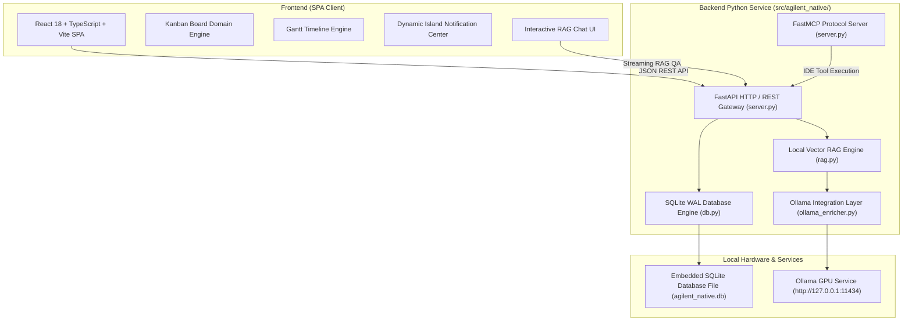

# Agilent Native Suite — Especificación Arquitectónica

## 🏗️ Visión General de la Arquitectura

**Agilent Native Suite** está estructurado bajo una **Arquitectura Hexagonal (Puertos y Adaptadores)** y **Clean Architecture**, optimizada para operar en un entorno de desarrollo local con **Cero Consumo de Tokens de Pago**.

---

## 🧩 Capas y Módulos Principales

### 1. Embedded Persistence Engine (`db.py`)
- **Base de Datos**: SQLite 3 en modo **WAL (Write-Ahead Logging)** para lectura/escritura concurrente ultra-rápida.
- **Transacciones**: Consultas parametrizadas con protección integrada contra inyecciones SQL.
- **Migraciones Automáticas**: Detección e inicialización de esquemas al arrancar.

### 2. FastMCP Gateway (`server.py`)
- **Protocolo**: Model Context Protocol (FastMCP) para integración directa desde IDEs de IA (Cursor, Antigravity IDE, VS Code, JetBrains, Neovim).
- **Consumo de Contexto**: Mínima huella de tokens (~300 tokens) para permitir que los agentes lean, editen y creen elementos del backlog.

### 3. Local RAG Engine (`rag.py` & `ollama_enricher.py`)
- **Modelos**: Conexión asíncrona a Ollama GPU local (`qwen3:14b` o modelo equivalente disponible).
- **Procesamiento de Texto**: Vectorización local y búsqueda TF-IDF / cosenoidal sobre tareas, descripciones y comentarios sin enviar datos fuera de la máquina del usuario.

### 4. Native Web UI (`frontend/src/`)
- **Diseño**: Tema glassmorphic oscuro con animaciones micro-interactivas y paletas tailoreadas.
- **Internacionalización**: Contexto global de idioma (`LanguageContext.tsx`) soportando Español (`es`) y Inglés (`en`).
