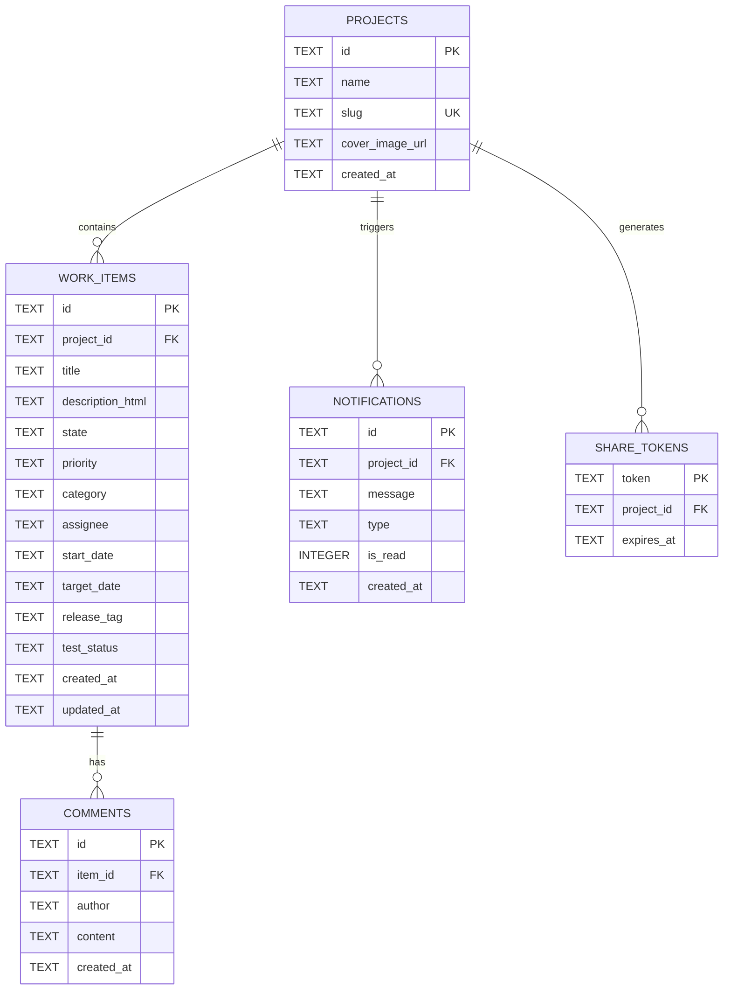

# Agilent Native Suite — Modelo Entidad-Relación (ERD)

## 📊 Diagrama ERD (Mermaid)

---

## 🗄️ Especificación de Tablas SQL

### 1. Tabla `projects`
Guarda la entidad principal de los proyectos creados por el usuario.
- `id` (TEXT, PK): Identificador UUID v4.
- `name` (TEXT): Nombre descriptivo del proyecto.
- `slug` (TEXT, UNIQUE): Slug URL-friendly del proyecto.
- `created_at` (TEXT): ISO 8601 timestamp.

### 2. Tabla `work_items`
Guarda las tareas o tarjetas del backlog asociadas a un proyecto.
- `id` (TEXT, PK): UUID v4 del elemento.
- `project_id` (TEXT, FK): Referencia al proyecto propietario.
- `title` (TEXT): Título corto del elemento.
- `description_html` (TEXT): Contenido en HTML generado por el editor WYSIWYG.
- `state` (TEXT): Estado Kanban (`backlog`, `in_progress`, `client_approval`, `done`).
- `priority` (TEXT): Prioridad (`high`, `medium`, `low`).
- `category` (TEXT): Tópico o etiqueta de clasificación.

### 3. Tabla `notifications`
Registro de notificaciones del sistema para el Notch superior.
- `is_read` (INTEGER): Estado de lectura (0: no leída, 1: leída).
